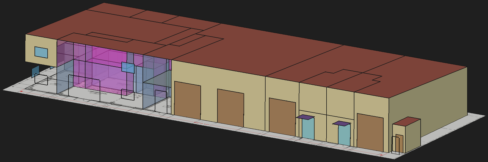

# FreeCAD ↔ OpenStudio geometry bridge

[](https://github.com/Ski90Moo/freecad-openstudio-bridge/actions/workflows/tests.yml)

**Draw the floor plan once in FreeCAD; read exact coordinates out of it.**

Headless Python that turns a traced FreeCAD floor plan into OpenStudio
building-energy geometry, reads the built model back into FreeCAD so windows
and doors can be placed by hand on the real wall faces, and propagates plan
changes into an existing model *without* losing the HVAC, constructions and
schedules already assigned to unchanged zones.



*A built model read back into FreeCAD and shaded by `colorize.FCMacro`:
exterior walls tan, roof brown, interior partitions translucent blue, windows
cyan, doors and overhead doors brown, entrance canopies purple. The magenta
panels are **air boundaries** — the deliberate absence of a wall, where two
spaces are open to each other. The pale plane underneath is the
scale-calibrated floor plan image the whole model was traced from, still sitting
at z = 0 where it was drawn.*

```
  FreeCAD Python 3.11                     bridge venv (Python 3.12)
  (bundled with FreeCAD 1.1)              pip install openstudio==3.11.0
          |                                          |
   fc_export_floorplan.py  --floorplan.json-->  build_osm_geometry.py
                                                     |
                                                <model>.osm
                                                <model>.fcmap.json
                                                     |
   fc_import_surfaces.py  <--surfaces.json--   dump_osm_geometry.py
          |
   you draw window/door rectangles on real 3D wall faces
          |
   fc_export_openings.py   --openings.json-->  apply_openings.py --> updated .osm
```

## Why

Deriving vertices by reading a floor plan image is the least reliable step in
the whole modelling chain. Partitions land misaligned, corridors get skipped
because a hallway is *the absence of a polygon*, and a single room can take
three rounds of correction before its walls sit where the drawing says.

Tracing in a CAD tool with snapping and constraints moves the measurement
problem to where it belongs — a person with a drawing — and makes every room's
area machine-checkable against the model built from it. Coordinates come out
exact rather than estimated, and the same check runs again on every re-export.

## What this is not

Not a FreeCAD addon, not an MCP server, no GUI dependency, no Docker.
Everything is scripts you run from a shell, so the pipeline stays diffable,
re-runnable and reviewable. A handful of optional `.FCMacro` files add GUI
conveniences on top; nothing requires them.

Geometry is built directly with the `openstudio` Python bindings. Where the
docs below mention *the MCP*, that means an OpenStudio MCP server taking over
after the geometry exists — for weather, constructions, HVAC and simulation.
The bridge neither needs nor talks to one.

## Requirements

| | |
|---|---|
| [FreeCAD](https://www.freecad.org/) 1.1 | Tested on 1.1.3. Ships its own Python 3.11 with `Part`, `Draft`, `Sketcher` and `BOPTools`. |
| Python 3.12 | For the venv that runs the model side. |
| `openstudio` 3.11.0 | pip wheel; must match the [OpenStudio](https://openstudio.net/) version you simulate with. |

Developed on Windows 11. The Python is platform-independent, but `bridge.ps1`
is PowerShell and the documented paths are Windows — on Linux or macOS call
the two interpreters directly (see the table below).

## Install

```
git clone https://github.com/Ski90Moo/freecad-openstudio-bridge.git
cd freecad-openstudio-bridge

python -m venv osvenv
osvenv/Scripts/pip install -r requirements.txt
```

`openstudio` is the only thing the bridge itself needs; `jsonschema` comes
along so `schema/floorplan.schema.json` can be checked against a real exported
plan rather than only read — a schema nothing validates against is decoration.
`requirements-elevations.txt` adds the PDF-reading extras for `elevations/`.

Run the tests — 340 of them, no FreeCAD or drawing needed for all but a few:

```
osvenv/Scripts/python.exe -m unittest discover -s tests
```

The same suite runs on Ubuntu, Windows and macOS on every push. CI then builds
the sample model from [`samples/plan.json`](samples/plan.json), applies its air
boundaries, and checks the result: 37 spaces, 321 surfaces, 2 stories, 37 zones
and 14 air-boundary constructions, with the rated walls still solid. So the
model half is exercised end to end on three platforms, not just in parts —
which is what the badge above reports, and the only thing keeping *"the Python
is platform-independent"* an honest claim rather than a hopeful one.

Eleven skip in that first suite run: seven need FreeCAD's geometry kernel,
which no runner has, and four need a built model, which at that point does not
exist yet. Those four are the air-boundary invariants, and CI re-runs them
against the model it has just built — that is what `BRIDGE_TEST_OSM` is for.
Only the seven FreeCAD tests go uncovered, and they are exercised by hand
against [`samples/`](samples/).

For the GUI macros, point FreeCAD's **Macro → Macros… → User macros location**
at this checkout. If you would rather keep it elsewhere, set the
`FREECAD_BRIDGE` environment variable to the checkout path instead.

## Quickstart

[`samples/FloorplanTest-02.FCStd`](samples/FloorplanTest-02.FCStd) is the
worked example the rest of this file quotes numbers from — the two-storey
light-industrial building above, 37 spaces on a 45° north axis, traced and
fully tagged. Every command below runs against it as shipped, so you can see
the whole pipeline work before drawing anything of your own:

```powershell
$FC = "C:\Program Files\FreeCAD 1.1\bin\python.exe"

# exact vertices out of the drawing
& $FC fc_export_floorplan.py samples\FloorplanTest-02.FCStd --out plan.json

# build the model  (writes demo.osm + demo.fcmap.json)
osvenv\Scripts\python.exe build_osm_geometry.py plan.json --out demo.osm

# read the built geometry back out
osvenv\Scripts\python.exe dump_osm_geometry.py demo.osm --out surfaces.json

# and the windows and doors already drawn on it
& $FC fc_export_openings.py samples\FloorplanTest-02.FCStd --out openings.json
```

You should get **2 stories, 37 spaces, 1267.3 m²**, then **321 surfaces** and
**28 openings** (5 doors, 15 fixed windows, 4 glass doors, 4 overhead doors).
The build step prints an area check — every space's floor area compared with
what FreeCAD measured — and fails if any disagrees by more than 0.1%. On this
model the worst disagreement is 0.0092%.

The sample comes fully tagged, so these four leave it byte-for-byte unchanged
— the exporters only write back into a document when they have to mint an
`OS_SpaceId` for something untagged, and there is nothing left to mint.

`samples/openings.json` is exactly what the fourth command produces.
`samples/surfaces.json` is the same format but taken from the fully worked
model — it carries the 28 openings and 4 shading surfaces a bare geometry
build has not got yet, and its space names are one ordinal apart, because
`build_osm_geometry.py` reuses the ordinals a previous build gave each
`OS_SpaceId` and a build from scratch has no previous build to read. Both are
kept so the exchange format can be read without running anything at all.

## Documentation

| | |
|---|---|
| This file | Workflow, every command, and the reasoning behind each step |
| [TAGGING.md](TAGGING.md) | **The working reference** — what to tag in the document and where |
| [IDENTITY.md](IDENTITY.md) | How the bridge knows a room is the same room after the plan moves |
| [FreeCAD-FAQ.md](FreeCAD-FAQ.md) | FreeCAD behaviours that bite while tracing |
| [elevations/README.md](elevations/README.md) | Optional: reading openings out of a PDF drawing set |
| [markup/README.md](markup/README.md) | v1/prototype: seeding a new document's floor plans from a purple-annotated drawing set, instead of placing the reference image by hand |
| [samples/](samples/) | The worked example drawing, and a real `surfaces.json` and `openings.json` |

## Licence

GPL-3.0-or-later. See [LICENSE](LICENSE).

---

## Setup

Two interpreters are involved and they are not interchangeable:

| Runtime | Path | Runs |
|---|---|---|
| FreeCAD Python 3.11 | `C:\Program Files\FreeCAD 1.1\bin\python.exe` | `fc_*.py`, `verify_roundtrip.py` |
| bridge venv 3.12 | `osvenv\Scripts\python.exe` | `build_*.py`, `dump_*.py`, `apply_*.py`, `update_*.py` |

`bridge.ps1` resolves both for you.

---

## Drawing conventions — the contract

**[TAGGING.md](TAGGING.md) is the working reference** — what to tag, where in
the GUI, and what breaks if it is missing. The summary below is the contract
itself. **[IDENTITY.md](IDENTITY.md)** covers the separate question of how the
bridge recognises a room, window or canopy it has seen before, why there are
three carriers rather than one, and the consolidation that has been considered
and deferred.

The bridge is only as good as the document following these. All of them are
checked, and a violation stops the export rather than guessing.

### 1. One sketch per story

Wall **centerlines** only, drawn as a connected network. Not room outlines,
not wall faces — `OS:Surface` geometry is infinitely thin and shared between
adjacent spaces, so a vertex traced on a wall's room-side face either
double-counts the wall thickness or leaves a gap.

The rooms are recovered automatically as the enclosed regions of that network,
so shared walls are drawn once, not twice.

### 2. Story metadata lives on the sketch

Set these in the Data tab, OpenStudio group (`fc_seed_labels.py --init-stories`
adds them):

| Property | Meaning |
|---|---|
| `OS_StoryName` | e.g. `Level 1` |
| `OS_Elevation_m` | floor elevation, metres; negative for below grade |
| `OS_FloorToFloor_m` | floor-to-floor height, metres |
| `OS_Include` | tick to export this sketch |

Every space on a story is extruded to `OS_FloorToFloor_m` unless its own label
carries an `OS_Height_m` override (see below).

A sketch without `OS_Include` is ignored, so scratch and reference sketches are
safe to leave in the document. Building north axis goes on the **document** as
`OS_NorthAxis_deg`.

### 3. Stories may sit side by side *or* be stacked

Each sketch's own `Placement` is its origin — every position test runs in the
sketch's own frame via `Placement.inverse()`, so both layouts work:

- **side by side** on the sheet, every sketch left at `z = 0`;
- **stacked** at real elevations, as the shipped
  [sample](samples/FloorplanTest-02.FCStd) does
  (`Sketch001.Placement.Base.z = 3378.2`).

Stacked, the stories share a footprint, so in-plane position alone cannot say
which story a label belongs to. Each label goes to the story plane it is
**nearest** to, and only then is it matched in-plane. Height above the plan
still does not matter within a story. Side by side the planes coincide, every
label ties, and containment decides as before.

The exporter reports footprints that appear identically on more than one story
— stairwells, shafts, chases. If two stories share **none**, they are almost
certainly misaligned and you get a warning.

**Stacked, `--init-stories` derives `OS_Elevation` and `OS_FloorToFloor` from
that same `Placement.Base.z` instead of leaving them at their defaults** — the
spacing between two stacked sketches is exactly a floor-to-floor height, so
typing it in twice (once by drawing, once by hand into a property) is a
duplication with nothing checking the two agree. The topmost story still needs
`OS_FloorToFloor` set by hand, since there is no story above it to measure
against. Re-running `--init-stories` re-derives both from wherever the
sketches currently sit, so nudging a stacked sketch and re-running keeps them
honest. Side by side, every sketch is at `z = 0` and there is nothing to
derive — both stay manual, as before.

### 4. One Draft Text label inside every room

First line is `ROOMNUM | Room Name`:

```
105 | Office
RR-203 | Restroom
HALL-1 | Corridor
```

A hidden `OS_SpaceId` property on each label carries a UUID, minted on first
export and written back into the FCStd. **That UUID is the identity anchor** —
it is what lets an architectural update rebuild only the rooms that moved
instead of regenerating everything and losing the HVAC.

### 4a. A room that is not its story's height

`OS_Height_m` on the label overrides `OS_FloorToFloor_m` for that room alone;
`0.0` (the default on every label) defers to the story. Use it for a
double-height lobby or a bay open to the roof. `intersectSurfaces` then splits
the raised walls at the story line, so the part above correctly bounds the
rooms overlooking the void rather than being exterior. The override joins the
change-propagation hash only when set, so adding one rebuilds exactly one
space. See `TAGGING.md` for the full treatment.

### 5. An unlabeled enclosed region is an error

The export refuses to run. This is deliberate: a corridor is often the
*absence* of a drawn room — leftover area nothing else claimed — and that is
exactly what got silently skipped when the geometry came from a PDF. Here it
still shows up as an enclosed face, so it cannot be missed.

Run `fc_seed_labels.py` to drop a placeholder into every unlabeled region, then
rename them in the GUI.

Not every enclosed region is a room, though. Label one `SKIP`, `-`,
`OPEN TO BELOW` or `NOTASPACE` -- in either field, any case -- to record that
it is deliberately not a space:

```
SKIP | open to below
```

Use this for the area outside a partial mezzanine's extent, open-to-below
voids, and courtyards inside the envelope. The area is reported so you can see
what was left out. The point is that the decision is written down rather than
being a hole in the model.

> On an earlier drawing of the sample building, the Level 2 sketch traced the
> full building footprint, so both stories came out at 923.4 m² — a mezzanine
> covering 100% of the ground floor. Marking the three large regions
> `SKIP` dropped the second story to 14 rooms and 406 m², which is the building
> as drawn. To model those areas as open-to-below companion
> spaces instead, label them normally and apply the existing
> `assign_air_boundary_construction` measure to their floors.

### 5a. Air boundaries are found, not listed

Four kinds of interior surface are not real constructions and want an
`OS:Construction:AirBoundary`:

- **Shafts.** Two rooms on different stories with the same footprint — a
  stair, a lift shaft, a riser — are one volume the bridge has to model as one
  space per story. Their shared floor/ceiling is an artefact of that split.
- **Mezzanine edges.** A wall between a mezzanine and a space carrying an
  `OS_Height_m` override is a guardrail.
- **Corridor cross-sections.** A wall that slices a corridor square across its
  run is a modelling division: the corridor is one continuous volume and the
  plan cut it into spaces. See *Corridors* below — the obvious test is not
  quite enough on its own.
- **Open stair edges.** The long sides of a stair labelled `Open Stair`, where
  they face a space that spans storeys or a mezzanine, are guardrails. Its
  *ends* are not derivable — see *Open stairs* below.

`find_air_boundaries.py` derives all four from the exported plan and prints
the surface list; the existing `assign_air_boundary_construction` measure does
the assigning:

```powershell
osvenv\Scripts\python.exe find_air_boundaries.py `
    runs\fptest02.osm runs\floorplans\fptest02.json
# add --apply-json for the apply_measure arguments as JSON,
# or --delta-t to re-size against a different temperature difference
```

It reads footprints from the **JSON, not the .osm**, and that is not an
arbitrary choice. `intersectSurfaces` splits a mezzanine's floor into one
fragment per room beneath it, and a fragment can coincide exactly with the
small room below — four such coincidences exist in `FloorplanTest-02`, and
each would register as a false shaft. The JSON holds whole rooms, before any
splitting.

**Re-run it after a full rebuild.** Surface names are regenerated every time
`build_osm_geometry.py` runs, so the assignment does not survive one. An
incremental `update_osm_geometry.py --apply` does keep it, on every space it
does not rebuild.

#### Corridors

The rule reads off the drawing: a corridor's shared wall that is **narrow
compared with the length of the hallway** is an opening, not a wall. On its own
that is not enough, because a wall's width says nothing about which side of the
corridor it sits on. Measured on `101a Hallway`, 8.58 m long × 1.65 m wide:

| shared wall | width | w / L | |
|---|---|---|---|
| to `101 Lobby` | 1.65 m | 0.19 | an open end |
| to `101b Hallway 6` | 1.65 m | 0.19 | an open end |
| to `102 Office` | 1.29 m | **0.15** | a piece of the side |

The office frontage is the *narrowest* wall on that corridor, and it is a wall.
So two more conditions come in, both saying the same thing — that the surface
is a slice through the corridor rather than a fragment of its flank:

| condition | flag | default |
|---|---|---|
| narrow against the run | `--corridor-narrow-ratio` | `w / L ≤ 0.25` |
| spans the corridor's own width | `--corridor-span-tol` | `w / W = 1 ± 0.15` |
| stands square to the run | `--corridor-square-cos` | `\|cos\| ≤ 0.30`, ~17° |

All three together select exactly the corridor ends on `FloorplanTest-02` and
reject the office fragment (`w/W` 0.78), the restrooms off `101b` (1.46), the
stair alongside `101a` (parallel to the run) and the shop wall on `101c`.

Length and width come from the footprint's **minimum-area bounding rectangle**,
not from x and y — this building is drawn on a 45° north axis, and measuring on
the global axes would report every corridor as nearly square.

An L-junction satisfies the square-to-the-run test from only **one** of its two
corridors: where `101a` ends into the flank of `101b`, `101a` sees a
cross-section and `101b` sees a piece of its own side. Each pair is therefore
tested from both corridors and taken if either agrees. Surfaces already claimed
as a shaft or a mezzanine edge are left alone — one surface, one construction.

**Two openings in one plane, on different storeys, are rejected.** `101c` is
two stories tall and ends against office `107` below and IT room `116` above,
in the same plane. Both cannot be open — a person would step out of `116` into
the void over the corridor. In real construction the upper one is a guardrail
over a wall below, or there is no upper opening at all; either way it is a
special case, so neither is assigned:

```
REJECTED -- 2 cross-section(s) open at two storeys in one plane
    Surface 22   032-116-IT Room     z 3.38-6.09
    Surface 288  011-107-Office      z 0.00-3.38
```

If the upper one really *is* a guardrail, the way to say so already exists:
label that upper room a mezzanine and rule 2 takes its edge.

This applies **only across the run**. A long side open at two storeys is an
ordinary double-height edge — which is exactly what the open-stair rule leans
on.

**What no rule can settle.** A corridor that dead-ends into a room *on one
storey* looks exactly like one that opens into a lobby. Pairs whose far side is
not itself circulation or open floor are selected and then called out by name.
Only you can separate them: drop one with
`--corridor-exclude '<space name>'`, or skip the rule entirely with
`--no-corridors`.

#### Open stairs

A stair is a corridor stood on end, and it inherits the corridor problem in a
sharper form. `101d`'s stair is 5.75 × 1.58 m, stacked over two storeys:

| | `x=6.05` end | long sides | `x=11.80` end |
|---|---|---|---|
| L1 `Open Stair` | → 101a Hallway | **→ Lobby**, → 108 Conf | → Lobby |
| L2 `Open Stair 2` | → 113 Mezzanine | **→ Lobby**, **→ 113 Mezz** | → Lobby |

The **sides** are unambiguous: a stair open along its length to a double-height
lobby has a guardrail there whichever way the flight runs. Those are taken
wherever the far side spans storeys or is a mezzanine — the side onto `108
Conference` is not, being an ordinary room on one storey.

The **ends** are not derivable at all. You step onto the flight at the bottom
and off it at the top, and those are opposite ends, so on each storey exactly
one end is open and the other is the wall behind the flight. Which one is drawn
as a direction arrow, and the plan carries no arrows. So they are listed and
left alone:

```
YOUR CALL -- 2 open-stair END(s), one per storey is a wall
    Surface 28   005-101d-Open Stair     -> 001-101-Lobby Reception
    Surface 178  028-101d-Open Stair 2   -> 029-113-Open Work Space Mezzanine
```

Record the ones you decide are open with `--open-surface` rather than
assigning them by hand — they are then sized and grouped with the sides of the
same pair, and the run reproduces. See *The engineer's overrides* below.

Labelling the room `Open Stair` is the entire opt-in. A plain `Stair` is
assumed enclosed, which is the safe reading: a fire-rated stair with a
self-closing door is the common case, and an air boundary there would be wrong
in a way the results would not obviously show.

#### The engineer's overrides

Two things a floor plan does not record, so no rule can reach them:

| flag | for |
|---|---|
| `--solid-surface` | real construction — a fire wall, a rated separation — overriding any rule that selected it |
| `--open-surface` | an opening no rule derives — a stair end, a doorway held open by design |

`205 Mezzanine` is the case that forced the first: its edges onto the lobby and
onto `101c` read as guardrails and are in fact a **fire wall**. Nothing in the
geometry distinguishes the two, because the difference is the rating.

Both match on **either face** — an air boundary is a property of the pair, and
half of one would mean nothing. Both are echoed back under an
`ENGINEER OVERRIDES` banner, so a hand decision never disappears into the
model silently:

```
ENGINEER OVERRIDES -- 7 surface(s) set by hand, not derived
    SOLID  Surface 221  034-205-Mezzanine     -> 004-101c-Hallway
    SOLID  Surface 292  034-205-Mezzanine     -> 001-101-Lobby Reception
    OPEN   Surface 129  021-204-Stair         -> 020-204-Shop
    OPEN   Surface 176  028-101d-Open Stair 2 -> 001-101-Lobby Reception
    ...
```

A promoted surface **joins the construction already covering its space pair**
rather than starting a second one. That is not tidiness: EnergyPlus creates
mixing per `Construction:AirBoundary`, so two constructions between one pair of
zones would **double the flow**, and neither the model nor the results would
say so. `tests/test_air_boundary_sizing.py` asserts it against the built model.

Both flags are held by the **single surface**, deliberately — not by the space
pair. A pair can share many surfaces (`Mezzanine 113 to 101` has six) and they
need not all be the same kind of thing, and naming one surface asks less of the
engineer than working out what it is matched to.

The cost of that is a caveat worth reading properly. Surface names belong to
OpenStudio, not to this bridge — nothing here ever calls `setName` on a
surface. A full rebuild reassigns them all, and **a few land differently every
time**. Two builds of the byte-identical floorplan JSON:

```
build A vs build B, same JSON: 8 of 314 names differ
  Surface 263   A: 020-204-Shop -> 021-204-Stair
                B: 017-201-Office -> 018-202-Storage
```

`Surface 263` is in `Air Boundary - Opening 204`. In one build it is the stair
opening; in the other it is a partition between an office and a store. The
churn sits in the fragments `intersectSurfaces` makes when it splits a wall —
306 of 314 were stable, which is what makes this dangerous rather than obvious.

**So re-read both lists off the report after a full rebuild**, and do not
assume unchanged input gives unchanged names. The per-pair listing prints
`space → space` for every surface, which is what to match on.

`update_osm_geometry.py --apply` is safe. It rebuilds only spaces whose vertex
hash moved; nudging one vertex of `102 Office` by 50 mm changed 5 surfaces, and
every one kept its space, its partner and its name — only the areas moved by
the 0.13 m² the nudge caused. All 16 constructions survived.

Space names are the stable identifiers here, being ID-anchored rather than
OpenStudio's: `034-205-Mezzanine` keeps its ordinal because
`build_osm_geometry.py` reuses the name a previous build gave that
`OS_SpaceId`. That is why the report identifies every surface by the spaces it
joins.

Finding them is one command and applying them is another, so the report can be
read before anything is written:

```powershell
osvenv\Scripts\python.exe find_air_boundaries.py demo.osm samples\plan.json `
    --apply-json --solid-surface (Get-Content samples\rated-walls.txt) `
    --out boundaries.json
osvenv\Scripts\python.exe apply_air_boundaries.py demo.osm boundaries.json `
    --out demo.osm
```

Fourteen constructions over 46 surfaces, which is what CI asserts on every
push. Use `--out` rather than `>`: PowerShell's redirect writes UTF-16 and the
reader opens UTF-8, which fails on the first byte a long way from the cause.

`--solid-surface` is the modeller's veto, and
[`samples/rated-walls.txt`](samples/rated-walls.txt) holds it for the sample:
205 Mezzanine meets the lobby and 101c through **rated** walls, which look
exactly like guardrail edges to rule 2. No rule can tell a fire wall from an
open edge by its geometry, because the difference is not geometric.

> **Those are surface names, and surface names are positional.** Re-export
> after moving anything and they may point at different walls entirely — the
> list that used to be here named a floor between two offices by the time
> anyone checked. This is not silent: `test_the_fire_wall_stayed_solid` keys on
> room numbers, which the drawing does fix, and fails when the declaration
> rots. Re-derive it by running without `--solid-surface` and reading which
> constructions span the rooms that should be solid.

#### The air-change rate is sized, not defaulted

EnergyPlus takes one rate per `Construction:AirBoundary` and applies it
"using the volume of the smaller zone as the basis" (`Energy+.idd`, field N1).
One rate can therefore only be right for one pair of spaces, so
`find_air_boundaries.py` groups openings **by space pair** and emits one
construction each — sixteen on `FloorplanTest-02`, not four, and fourteen once
the two rated walls above are declared solid.

For each pair it sizes the buoyancy exchange from the opening geometry. The two
orientations are different problems:

| Opening | Correlation | Coefficient |
|---|---|---|
| vertical (mezzanine edge) | `Q = (Cd/3) W H^1.5 sqrt(g dT / T)` — Brown & Solvason counterflow | `Cd = 0.43` |
| horizontal (shaft through a floor) | `Q = C sqrt((g dT / T) D^5)` — Epstein (1988), thin-partition regime | `C = 0.055` |

`Cd = 0.43` is the value measured in **IEA Annex 20 Subtask 2**, *Air Flow
Through Large Openings in Buildings* (van der Maas ed., EPFL 1992) — "in
agreement with reference experiments used by ASHRAE"; the spread across studies
is 0.35–0.63. The textbook 0.6 sits at the top of that, and Annex 20's own
Fig. 2.18 notes that measured doorway velocities were "generally smaller than
the calculated parabolic profile using a discharge coefficient of 0.6".

The report also prints **Aw**, the aperture width ratio, because Annex 20
§2.3 shows it is the parameter that decides which regime you are in: Scott et
al. had to shrink Aw below **0.1** to block boundary-layer flow and drive the
two zones to different temperatures at all. Above that the flow runs in
boundary layers at the top and bottom of the aperture rather than as bulk
counterflow, and the isothermality factor collapses toward zero. Six of the
seven pairs here sit at Aw 0.17–0.50, so the sizing is extrapolation — but it
errs toward *too little* coupling, not too much.

`Q` is the one-way exchange — the same volume returns the other way, which is
what an air change is — so `ACH = Q * 3600 / V_smaller`. A slab is about 0.2 m
against a ~3.4 m stair opening, `L/D` of 0.06, comfortably inside the
thin-plate regime whose boundary is 0.15.

**`dT` is not a free parameter.** An air boundary is used precisely where two
zones are open to each other, and the exchange above is the mechanism that
holds them together — so they equilibrate. **0.5 K** is the accepted working
figure and the default. A large `dT` and an open boundary are mutually
exclusive: 10 K between adjacent commercial zones means an enclosure, a cold
store or a sauna, and those do not have an open boundary in the first place.
`--delta-t` is there for an engineer's judgement on a genuine edge case, not
for exploring a range.

There is a consistency worth noticing: the rates come out high, and that is
exactly *why* the 0.5 K premise holds. `Q` scales with `sqrt(dT)`, so even a
4× error in `dT` moves every rate by only 2× — the result is robust to the one
number that was assumed.

| pair | area m² | Aw | sized ACH | applied |
|---|---|---|---|---|
| Corridor 101c to 101 | 10.6 | 0.08 | 18.9 | **5.0** |
| Corridor 101a to 101b | 5.6 | 0.08 | 14.3 | **5.0** |
| Corridor 101a to 101 | 5.6 | 0.08 | 14.3 | **5.0** |
| Corridor 101b to 101c | 5.7 | 0.05 | 8.4 | **5.0** |
| Mezzanine 301 to 303 | 33.0 | 0.50 | 45.6 | **5.0** |
| Mezzanine 401 to 403 | 33.0 | 0.50 | 45.6 | **5.0** |
| Mezzanine 205 to 204 | 39.8 | 0.46 | 41.1 | **5.0** |
| Mezzanine 113 to 101c | 23.6 | 0.19 | 28.1 | **5.0** |
| Mezzanine 113 to 101 | 22.6 | 0.11 | 7.6 | **5.0** |
| Open Stair 101d to 101 — L2 | 19.9 | 0.50 | 88.6 | **5.0** |
| Open Stair 101d to 101 — L1 | 19.4 | 0.39 | 77.7 | **5.0** |
| Open Stair 101d to 113 | 15.6 | 0.39 | 69.5 | **5.0** |
| Shaft 101d | 9.1 | 0.23 | 22.2 | **5.0** |
| Shaft 204 | 8.6 | 0.21 | 21.9 | **5.0** |
| Mezzanine 205 to 101 | 14.7 | 0.17 | 15.2 | **5.0** |
| Mezzanine 205 to 101c | 1.7 | 0.01 | 2.0 | 2.0 |

`v` is the mean speed through half the opening, `Q / (A/2)`, and it is the
quickest sanity check on a rate: a few cm/s is a barely perceptible draft. For
a vertical opening it is width-independent — `v = (2/3) Cd sqrt(H) sqrt(g dT/T)`
— which is why every mezzanine edge reads the same 0.085 m/s. The ACH looks
large only because these upper zones are small next to the openings feeding
them.

#### The 5 ACH rate limit, and why it is not a fudge

`--max-ach` defaults to **5**, and fifteen of the sixteen pairs here are
capped by it.
This is not a correction to the sizing. An air boundary has two jobs that pull
against each other:

- **couple the zones at steady state** — what the sizing above is for;
- **stay loose enough that a transient can override the coupling** and reach
  the results.

At the sized rate (45 ACH) the second job fails: solar landing on a mezzanine
is absorbed into the space below within the timestep and never appears in the
output. That excursion cannot be computed in advance — it is the reason to run
the simulation at all — so the coupling has to leave room for it to show.

Because `ZoneMixing` is linear in `dT` (where the buoyancy it stands in for
goes as `dT^1.5`), the rate is exactly a ceiling on how far the zones may
drift. At 5 ACH across the 79.5 m³ `301` mezzanine:

| imbalance | settled dT |
|---|---|
| 100 W | 0.75 K |
| 1 kW sustained | 7.5 K |

The corridors are tighter still, because each has two or three boundaries and
the mixing objects add: `101a` shows 12.5 K per pair but couples at roughly
half that across both its ends. So ordinary conditions still couple tightly,
and a real excursion becomes visible. **Read a large sustained split in the results as a finding about the
design** — stratification, or a mezzanine that wants its own equipment — not
as an artefact of the rate. Raise `--max-ach` only having decided the excursion
is not real; `0` disables the cap.

Zones are deliberately *not* merged, even where the coupling is strong. A
mezzanine may need its own equipment and its performance tracked separately,
and combining two zones later is far easier than separating them.

The measure's default remains `SimpleMixing` at 0.5 ACH for a bare call — which
for openings this size is low by two orders of magnitude — and it says in its
log whether the rate it was handed was that bare default or something that
actually sized it.

One trap worth knowing: `ConstructionAirBoundary`'s constructor writes `0.0`
into the air-changes field rather than leaving it defaulted to the IDD's 0.5,
so setting `SimpleMixing` *without* also setting a rate yields a construction
that mixes nothing at all. The measure always sets it explicitly.

### 6. Openings are drawn in an elevation sketch, on the generated geometry

Fenestration follows the same rule as the plan — a person draws it, in CAD,
with snapping — but drawing an elevation from nothing is far more laborious
than drawing a plan, and none of that labour is judgment. Finding the wall
plane, orienting it, and projecting enough of the model into it to have
something to snap to are all derivable from the geometry the bridge already
generated. So the bridge does them.

Generate the model, bring the surfaces back into the *same* document, then:

```powershell
.\bridge.ps1 import surfaces.json --into samples\FloorplanTest-02.FCStd
.\bridge.ps1 planes samples\FloorplanTest-02.FCStd
```

`planes` finds every distinct exterior wall plane and gives each one a sketch:

* **attached to the traced plan** — `ThreePointsNormal` on the wall centerline
  that produced the facade, so the elevation stands up on the line you drew.
  Move that wall in the plan and the elevation follows it.
* **oriented like an elevation** — sketch +Y up, sketch +Z out of the
  building, origin at the left-hand end of the facade on the z = 0 datum. So
  sketch *x* is distance along the elevation and sketch *y* is height above
  the datum, which is how the drawings are dimensioned. An `AttachmentOffset`
  puts it there; the attachment alone would hand you whatever origin and axes
  OCC happened to give that line.
* **referenced to the plan** — that same wall centerline is projected in as
  the sketch's only external geometry, so there is a datum line to snap to and
  it moves when the wall does. Measured, it lands exactly where an elevation
  wants it: *y* = 0, *x* from 0 to the length of the facade.
* **pre-populated** — the model's existing subsurfaces on that plane are drawn
  in as coincident-constrained rectangles, so correcting one is a drag rather
  than a redraw. `--empty` skips this.

**Why the plan and not the wall face.** These sketches used to attach to the
largest imported wall face with `FlatFace`, which reads better — the sketch
plane *is* the wall — and is a trap. `import` replaces a surface's `Shape`
outright, so once the model changes, `FlatFace` re-derives the frame from a new
face whose parametrisation need not match the old one. Re-importing after a
roof change turned three of these sketches through **180°** and slid them up to
**39 m**, dragging 20 of 27 drawn outlines into positions nobody drew. The only
symptom was openings landing on the wrong walls.

The plan is what everything else is derived from, and nothing regenerates it.
Attaching there makes the whole class of failure impossible: re-importing the
same roofed model afterwards moves **nothing**.

**The external geometry follows the same rule: the plan, and nothing else.**
`planes` used to project the imported facade's edges in as snap targets —
references to the model inside a sketch that has to depend only on the
drawing, and to the one kind of geometry `import` replaces outright. On this
document 114 of them supported just 12 constraints. What goes in now is the
traced wall centerline the sketch is already attached to, plus every other
point the plan's wall network touches that same plane at — another wall
running *along* it (a distinct run sharing the line, never the same one
retraced), and every interior wall that only *crosses* it, T-intersecting the
exterior wall from inside the building. So what you snap to and what the
sketch stands on cannot come apart, and a door that should line up with an
interior partition has that partition's own centerline to snap to, not just
the facade's.

That second kind — a wall crossing the plane rather than running along it —
projects into the elevation as a point, not a line, because it has no extent
in the elevation's own two axes once you're looking straight at the facade
from outside. FreeCAD's own projection draws that distinction from the edge's
real 3D direction; nothing here classifies it first. This is exactly the two
ways the Sketcher's own External geometry tool were used by hand on this
building's "Openings South" before this followed suit: **G, X** on an edge
that shares the plane, **G, I** on one that only crosses it.

This is narrower than "every plan edge in the plane" sounds, and deliberately
so. Measured on FloorplanTest-02: seven plan edges lie in the south plane —
the envelope line plus the per-tenant walls drawn along it, which is not one
edge but several *overlapping* retraces of the same run — and three more on
the storey above; ten overlapping references would have been nine ambiguous
snap targets. What is offered is deduplicated by position first, so two edges
traced exactly on top of each other (found on this building: a duplicated
interior partition) still count once. A wall-network vertex on the plane with
no edge of its own to represent it — a jog where the facade's own wall
changes offset, not a T-intersection — is offered too, as a bare point.

`--no-external` skips the projection (the sketch is still *attached* to that
line; you just get nothing to snap to). `--keep-external` leaves existing
references to the imported model alone instead of removing them. `--external`
is accepted and ignored — it used to mean "pull the imported wall edges in",
which is the thing this replaced.

Re-running `planes` on an older document migrates it — the attachment moves to
the plan, references to the imported model are dropped, and the plan line goes
in — without moving an outline. It reports how many constraints went with the
dropped references, since those elements become free to drag; the plan line is
what to re-constrain them to. Re-running on a document that is already right
adds nothing: the reference is added only when it is missing, because draining
and re-adding it would cost every constraint made against it.

### 6a. The elevation drawing goes behind the sketch, placed by arithmetic

```powershell
.\bridge.ps1 crop                                    # cut the sheet into facades
.\bridge.ps1 elevations samples\FloorplanTest-02.FCStd elevations\facades\facade_images.json
```

`crop` renders the elevation sheet and cuts one image per facade; `elevations`
puts each on its wall as an `Image::ImagePlane`, sharing that facade's
elevation frame. Trace on the drawing and the result is already on the wall.

**Placing an elevation image by hand is where scale error enters the model.**
The one placed by hand for this building measured 0.25% out and 81 mm adrift
against the vector plans — invisible by eye, 0.2 m at the far end of the
facade, and it went into every opening traced over it. Here the crop window is
chosen in model feet and converted to sheet points through the same grid-line
calibration the plans use, so the manifest states exactly which model
coordinates the image's own edges land on and placement is arithmetic.

Two details worth knowing:

* the crop keeps the **vector annotation** — grid bubbles, datum lines,
  dimension strings — which `render.py` strips. That was noise for automated
  rectangle detection; for a person tracing, it is the most useful thing on
  the sheet.
* the plane goes **exactly on the wall**, which is exactly its opening sketch's
  plane — verified coplanar to 0.000000000 mm at every corner. That is the same
  arrangement the floorplan rasters already use (`FirstFP` and `Sketch` both at
  z = 0), and it is what you want to trace on: no parallax between the drawing
  and the line you are snapping to, however you orbit. `--standoff-mm` floats it
  clear if you would rather leave the wall faces shown — see §6b.

Images are embedded in the document (`App::PropertyFileIncluded`), so they
travel with it; `facade_images.json` records the registration if you need to
check it. Overlaying the model's own wall outlines back onto the placed image
is the quickest confirmation it landed right.

### 6b. Do not put transparency on an elevation drawing

**An elevation crop is 95% white paper, so transparency erases it.** FreeCAD
renders an `Image::ImagePlane` through `SoTexture2::MODULATE` against a white
diffuse material, so `Transparency = 70` means exactly 30% opacity and nothing
subtler. Measured on these images against FreeCAD's light viewport:

| image | px/m | mean level | at 30% opacity | background |
|---|---|---|---|---|
| `FirstFP` | 41 | 240.0 | 222.5 | 215 |
| `Elevation-South` | 123 | 229.0 | 219.2 | 215 |

Four to seven grey levels off the background is not faint, it is gone. The
elevations go first because they carry **3× the pixel density** of the
floorplan rasters, so their linework is three times finer on screen at any
given zoom and averages into the paper that much sooner.

Over a **dark** viewport the arithmetic reverses: the same 30% image composites
to about 100 against a background of 40, a 60-level separation that reads well.
So `Transparency = 70` is the right default on a dark theme and unusable on a
light one — it is a background choice, not a placement problem.

`elevations` therefore seeds new image planes at **`Transparency = 70`,
`Lighting = Two side`**. Headless FreeCAD builds no ViewProviders, so this is
written straight into `GuiDocument.xml` by `fcbridge.seed_view_defaults`, and
only for objects that have no entry of their own — once you have opened and
saved the document, every object has one and the seeding becomes a no-op. It
can never overwrite a setting you made.

Occlusion is a *separate* problem, and only when the geometry is shown: an
imported surface is an opaque face, the floorplan rasters share planes with the
storey slabs (`FirstFP` at z = 0 against 28 floor faces at z = 0), and each
elevation sits 1 mm off its wall. `trace_mode.FCMacro` (Macro → Macros… →
Execute) hides every imported surface and leaves the images, the opening
sketches and the storey traces; run it again to put the model back. It touches
`Visibility` only, so it does not fight `colorize.FCMacro` over colours.

Hiding the walls costs nothing: the outlines you are editing live in the
sketch, not in the face, and the thing to snap to is the projected plan line,
which is native sketch geometry and stays visible (§6).

Hiding them is also what makes the coplanar default work. Two coplanar *faces*
z-fight, so the wall surface has to be out of the way; sketch lines do not,
because FreeCAD draws edges with a polygon offset and they read cleanly on top
of a coplanar image. If you would rather leave the geometry shown, float the
drawing clear with `--standoff-mm 1` instead of hiding anything — at the cost
of a millimetre of parallax between the drawing and the sketch you trace on it.

Then draw each opening as a closed outline. **Every closed wire in a sketch
flagged `OS_OpeningSketch` is an opening**, so a whole facade is one sketch,
which is how a person actually draws an elevation.

Type comes from the outline's own shape, measured against the host wall's
floor line — not global z, so a door on the second storey still reads as a
door:

| shape | becomes |
|---|---|
| sill ≤ 0.20 m, height ≥ 3.00 m | OverheadDoor |
| sill ≤ 0.20 m, width ≥ 1.70 m | GlassDoor |
| sill ≤ 0.20 m otherwise | Door |
| sill ≥ 0.45 m | FixedWindow |
| sill between the two | reported, not guessed |

Every one is printed with its dimensions when you export, which is the review
step — the same "human decides, machine measures" split as the plan.

**To overrule one outline among many** — the storefront in a row of doors —
select it and run **`tag_opening.FCMacro`**, then pick the type. There is no
limit: one sketch can hard-specify a glass door, an overhead door and an
operable window at once, and everything left untagged is still classified by
shape. Picking `(classify by shape)` removes a tag again.

```
name                         type              w m    h m   sill  typed by
GlassDoor South 03           GlassDoor        4.35   2.73   0.00  shape
GlassDoor South 06           GlassDoor        1.69   2.73   0.00  tag
```

The macro takes a selection either way round, because the honest workflow is
**classify, then correct**:

* **edges selected while editing the sketch** — tagging as you draw;
* **an imported subsurface selected in the tree** (`GlassDoor South 10`) — you
  looked at the import, spotted the two it got wrong, and clicked one. The
  macro walks back to the outline it was drawn from and tags *that*, because
  the object in the tree is the model's reflection and editing it does nothing
  (see TAGGING.md). The walk-back handles the display offset and, for an
  opening projected onto a setback wall, compares elevation coordinates only —
  measured at 28 of 28 on this document, `Door South 13` included.

The type rides on the geometry as a `Part::GeometryStringExtension` named
`OS_SubSurfaceType` — the same name as the property on the imported object, on
the thing that actually owns it. That is **document data, not view data**, so
it survives a save, a drag, a new constraint, and it follows its element when
other geometry is deleted. One outline tagged with two different types is
refused by name, and an unreadable tag is reported rather than ignored —
silently dropping one would put the wrong type in the model.

**Nothing in FreeCAD displays it.** A geometry extension is not a property, and
the Elements panel lists `34-Line` with nowhere to put a tag — so inspecting
the sketch tells you nothing either way. `tag_opening.FCMacro` run **with
nothing selected** lists every tagged outline; each tagging run also prints the
sketch's tally before and after, and warns when they match.

Tagging also writes a **pending marker** back onto the model's own object —
an `OS_PendingType` property and a `[-> Door]` suffix on the tree label — so
the thing you clicked confirms the tag landed. The real `OS_*` fields stay as
import wrote them, because those are what `verify` compares against the model;
the marker is a third thing, the difference between the two. It clears itself
once they agree.

**`review_openings.FCMacro` is the check that counts**, and it needs no
terminal: it runs `fc_export_openings.classify_document` against the open
document and prints the whole table — every opening, its type, its host, and
whether that type came from a `tag`, a `label` or its `shape`. One
implementation, so the preview and the export can never disagree. A tag can be
written and still decide nothing (on construction geometry, on an outline that
is not closed, or on one that lands in no wall), which no listing of tags can
tell you. Save (Ctrl+S) before exporting — the macro reads the open document,
the export reads the file.

> A geometry **layer** was tried first and is gone: FreeCAD 1.1 offers Layer 0
> and Layer 1, so it capped you at one override kind per sketch.

To overrule a **whole sketch**, or to place an outline as its own object
rather than in a sketch, start the **Label** with the kind. That still works,
and it is the only way to get `OperableWindow` or `Skylight`:

| Label starts with | Becomes |
|---|---|
| `WINDOW` | FixedWindow |
| `OPWINDOW` | OperableWindow |
| `DOOR` | Door |
| `GLASSDOOR` | GlassDoor |
| `OVERHEAD` | OverheadDoor |
| `SKYLIGHT` | Skylight |

The host wall is found geometrically either way — the outline must be coplanar
with and inside exactly one surface — so there is no name to keep in sync.

### 6c. Reference geometry — the way to draw a line that is not an opening

Every closed wire of *normal* geometry in an opening sketch is an opening.
That is the whole rule, and it is why the sketch needs somewhere to keep lines
that exist only to draw against. FreeCAD has two kinds, and `openings` is
blind to both, because it reads `sketch.Shape.Wires` and FreeCAD builds
`Shape` from normal geometry alone.

| | what it is | how | drawn as |
|---|---|---|---|
| **External geometry** | a live link to an edge on another object | Sketch → Sketcher tools → External geometry (default **G, X**), then click the edge | dashed magenta |
| **Construction geometry** | a helper line belonging to this sketch | draw it, select it, Sketch → Sketcher visual → Toggle construction geometry (default **G, N**) | dashed blue |

The magenta lines already in every seeded sketch are the first kind: `planes`
calls `addExternal` once per distinct wall edge in the plane, so corners,
floor lines, storey lines and roof lines are snappable without projecting
anything by hand. Add more the same way — click an edge of any object in the
document and it comes in *still linked*, so it follows the model.

Construction geometry is the one to reach for when the line has no source
object to link to: a sill datum run across a facade, a spacing rail for a
window band, a diagonal to align a mullion, a rectangle you are still deciding
about. Toggling with nothing selected switches the mode for whatever you draw
next, so a run of helper lines need not be converted one at a time.

Measured, not assumed — a sketch holding one plain rectangle and one
construction rectangle, 8 line segments in all, reports **1 wire, 4 edges** in
its `Shape`. Toggle the plain rectangle to construction and `Shape` reports
**0 wires, 0 edges**; toggle it back and the wire returns. Adding four
external edges moves neither count.

**Normal geometry is never silently dropped, and that is the safety net.** A
closed wire becomes an opening and is printed with its dimensions in the
review table; an *open* one is reported by name as `not a closed outline` and
fails the export. So a helper line left in normal mode by mistake cannot slip
quietly into the model — it either asks to be reviewed or it stops the run.

### Imported subsurfaces stand 2 mm proud of their wall

An OpenStudio subsurface is exactly coplanar with its host — correct in the
model, unusable on screen. Coplanar faces z-fight, so a window flickers through
its wall, and a pick ray meets both at the same depth, so clicking a window as
often selects the wall. `import` therefore pulls each subsurface
`--subsurface-offset-mm` (default **2.0**) along its host's outward normal and
records the distance on the object as `OS_DisplayOffset_mm`.

It is a display offset and nothing else: **`verify` subtracts it before
comparing**, so the gate still holds to the micron and an offset that drifted
from what the object claims would fail like any other error. Nothing is written
back to the model from these objects — `openings` skips anything carrying
`OS_SurfaceName` or `OS_SubSurfaceType` — so the offset cannot leak into the
`.osm`. Pass `--subsurface-offset-mm 0` for exactly coplanar.

Two millimetres fixes picking from outside, where the window is now nearer the
camera. From inside, the wall is in front again and still wins.
`subsurface_focus.FCMacro` settles it from every direction: in focus mode
**every imported surface stops answering the cursor and only the openings
do** — 321 surfaces out of the way, 28 openings picking, on the test building.

The all-or-nothing is deliberate. Taking only the *obstructing* surfaces out of
the way leaves a model where some faces answer the cursor and some do not, so a
click that misses an opening lands on whatever happened to be behind it — an
interior wall, say, now live to drag or edit. Not being able to predict what a
click selects is worse than either extreme.

Nothing is hidden and nothing is recoloured: the model looks exactly the same,
and every surface stays reachable from the tree, where selecting one is
deliberate rather than accidental. Run the macro again to restore. Scope is the
imported geometry only — opening sketches, elevation images and room labels are
left alone, because you need those selectable to trace. It touches `Selectable`
only, so it composes with `trace_mode` (visibility) and `colorize` (colour).

### Walls set back from the facade: draw them on the facade anyway

An elevation is a **parallel projection**, so a lean-to, a reveal or a recessed
bay appears on the sheet in the same place as the facade in front of it, and a
person tracing it naturally draws it on the facade's own sketch. Do that. An
outline coplanar with no surface is projected back along the drawing's normal —
the exact inverse of how the elevation was made — onto the nearest wall facing
the same way:

```
projected onto a wall set back from the drawing (1) -- an
elevation is a parallel projection, so these were traced on the
facade in front of them.  Check the distance is the setback you
expect:
  Door South 13                  0.901 m back     Surface 316 037-501-Mechanical Room
```

This is the bridge's answer to SketchUp's **Project Loose Geometry**, and it
means the 501 lean-to needs no sketch of its own — one sketch per elevation
*drawing*, not per wall plane. Only walls facing the same way are candidates,
so the far side of the building can never be picked, and the nearest hit wins.
Two candidates the same distance away are reported rather than guessed.

The distance is printed for every projected opening because it is the one thing
about them a person has to check: it should be the setback you expect. A
surprise here means the outline was drawn over the wrong part of the sheet.

Facade names (`North`, `South`, `East 501`, …) are **plan north**, matching the
elevation sheets, not true north. This building's north axis is 45°, so its
"south" elevation faces true southwest; a sketch labelled `Southwest` for the
wall everyone points at as south is a trap. The true bearing is printed
alongside and lives in the model's north axis, where it belongs.

### 7. Canopies and fins are traced in **plan**, not in elevation

An opening is drawn in elevation because a window lives *in* a wall. A canopy
does not: it is a horizontal plate sticking out of one. Trace it in plan, on a
sketch whose z is the height of the plate, and the drawing *is* the shading
surface — true footprint, true height, no projection and no host to find.

Put a roof-plan or site-plan image on the sketch plane the same way `elevations`
places a facade drawing, trace each canopy as a closed rectangle, and:

```powershell
.\bridge.ps1 shading samples\FloorplanTest-02.FCStd --out shading.json
.\bridge.ps1 apply-shading runs\fptest02.osm shading.json
```

A sketch is a shading sketch when its **Label contains a keyword** — as the
first word (`CANOPY South entry`) or anywhere else (`Parapet Shading`) — or
when it carries a ticked `OS_ShadingSketch` boolean. A label match also sets
the name:

| Label contains | named |
|---|---|
| `CANOPY` | Canopy |
| `AWNING` | Awning |
| `OVERHANG` | Overhang |
| `FIN` | Fin |
| `SHADING` / `SHADE` | Shading |

`.\bridge.ps1 seed YourPlan.FCStd --init-shading` adds the `OS_ShadingSketch`
checkbox (Data tab, OpenStudio group) to every sketch that could plausibly
hold a shade — ticked already where the label matches, unticked everywhere
else — the same way `--init-roof` offers `OS_RoofMethod` on every roof
candidate without deciding for you.

Every closed wire in the sketch is one shading surface, exactly as in an
opening sketch. The facade in the name comes from the nearest exterior wall —
by the same `compass_of` rule that named the door underneath — and the gap to
it is printed, so a canopy that should be touching its wall and reads `0.412 m`
says so:

```
name                    area m2      z m   tilt  facade       gap m  nearest wall
Shading South 01          6.288    2.896    0.0  South        0.000  Surface 5
```

A shade near no wall is still exported, just without a facade in its name.

**Any planar sketch is read, whatever its orientation** — a vertical fin drawn
on an elevation sketch works the same way. Which way a shade faces is settled
for you: a horizontal one is wound to face up, a vertical one to face away from
the wall it stands off. Neither changes what it shades; both stop the model
displaying a canopy as if seen from underneath.

**Building, not Site.** Shades land in a `Building Shading Surfaces` group,
which rotates with the building's north axis — what an attached canopy must do.
`--group-type Site` puts them in a group that does not, for a neighbouring
building or a stand of trees. Both groups sit at the origin unrotated, so the
vertices in the model are the same building coordinates the FreeCAD document
holds, and `apply-shading` proves it by reading every one back through the
group's transformation before it saves:

```
added 4 shading surface(s)
  Building Building Shading Surfaces   4 surface(s), 13.354 m2
  worst read-back deviation: 0.000000000 m
```

Re-running replaces rather than accumulates: shades carrying this bridge's
marker comment are removed first, so redraw a canopy in FreeCAD and re-run.
Shading added by hand or by an MCP tool is left alone.

Open wires are **datum lines, not shades**. They are listed and skipped rather
than guessed at — the tidy way to keep one is to toggle it to construction
geometry (see §6c), which takes it out of the sketch's `Shape` and stops it
being reported at all.

`dump` and `import` carry shading both ways like anything else, so after
applying, a round trip brings the canopies back into the document in a
**Shading from the model** group, and `verify` counts them: surfaces +
subsurfaces + shading, all at `0.000000 mm`.

---

### 8. A roof with a real shape: two methods, one dropdown

Every space is a flat-topped prism until the document says otherwise. To give
the building its actual roof, draw the roof — as a face or as a solid — and set
`OS_RoofMethod` on it in the Data tab, OpenStudio group. Any object with a
shape can be the roof: a padded `PartDesign::Body`, its `Pad`, or a bare face
traced over the plan.

```powershell
.\bridge.ps1 seed samples\FloorplanTest-02.FCStd --init-roof
```

puts the dropdown on every candidate and leaves them all at `Ignore`, which is
the state the document was already in. Then pick one:

| `OS_RoofMethod` | what it does |
|---|---|
| `Ignore` | nothing. Every space keeps a flat top. |
| `Extend` | the rooms below grow up to meet the roof. |
| `Attic` | the roof becomes a space of its own. |

**Which one is right is an energy question, not a geometry one.** `Extend` puts
the roof construction directly against conditioned air, so the sloped area is
the loss surface — usually the honest model for a low-slope roof over an open
warehouse. `Attic` inserts an unconditioned buffer between the rooms and the
sky, which is what you want when there is a real ventilated cavity, a plenum,
or ducts running above the ceiling.

Preview either without leaving FreeCAD by running **`review_roof.FCMacro`**
(Macro → Macros… → Execute). It reads the open document, writes nothing, and
prints exactly what the export would do.

#### Extend

The roof describes where the top of the building is. Every space whose ceiling
currently sits at the roof's **lowest** point is carved against it, so its
ceiling follows the slope and its walls grow into trapezoids. Nothing else
changes: same spaces, same footprints, same floor area.

```
roof: Extend
  base 6.090 m, ridge 6.852 m, pitch 1.44 deg
  roof area 924.5 m2 over 923.7 m2 of plan (+0.09%)
  14 space(s) raised to it, roughly +328 m3 of volume
    Level 1      Shop                          6.090 ->  6.852 m      262.4 m2
    Level 2      Open Work Space Mezzanine     6.090 ->  6.852 m      153.9 m2
```

A space is a candidate when its top is within 50 mm of the roof's lowest point
— the eave line — so a storey below is never caught by accident. A space that
turns out not to be under the roof at all is left flat and reported; one that
is only *partly* under it is an error, because the part left out would have no
ceiling.

#### Attic

The roof is a solid sitting on top of the building, and it becomes a space in
its own right, on a story of its own (`OS_StoryName`, default `Attic`). Name it
with `OS_SpaceName` in the usual `NUMBER | Name` form; left blank, the object's
label supplies it, minus FreeCAD's `-001` copy suffix.

The rooms below keep their flat ceilings, and the attic gets a matching floor
over each one — so what was 923 m² of exterior roof becomes 923 m² of
interior ceiling, and the loss path now runs through the attic. **Give the
attic a construction set and decide whether it is conditioned**; nothing else
in the model will remind you.

An attic carries an `OS_SpaceId` exactly as a room label does, so it is the
same kind of thing to the change-propagation machinery: rename it, re-pitch it,
and it stays the same space.

**The attic's own floor is built directly, not left for `matchSurfaces` to
discover.** Each carved room's ceiling is mirrored into a Floor piece on the
attic side — same points, reversed, nothing computed — and whatever the
carved rooms do not tile is recovered by real 2D polygon subtraction against
the attic's own footprint, so an eave overhang or a void nothing claims still
gets a floor rather than a hole.

Each mirrored pair is then told to OpenStudio directly, with
`setAdjacentSurface`, **before** `intersectSurfaces`/`matchSurfaces` run over
the model — and that ordering is load-bearing, not a nicety. Handing
OpenStudio two already-identical surfaces is not enough on its own:
reconciling one large attic against many small room ceilings at once,
`intersectSurfaces` still refragmented 13 already-correct, already-mirrored
pairs into 31 pieces, 30 of them carrying a spurious diagonal edge that
matches nothing drawn in the plan — confirmed against SketchUp's own
`intersect_with`, run over the identical geometry, which produces the clean
13-piece result every time. Pairing the surfaces first stops
`intersectSurfaces` from re-examining them at all: it does not re-split a
surface that already has an adjacent one, so the same 13 pairs survive the
call untouched.

#### Both are checked before they are written

The winding of a surface is what OpenStudio derives `Floor` / `Wall` /
`RoofCeiling` from, and a face wound inside out is accepted without a word —
the space simply comes out with a negative volume. So the faces are not trusted
on their own:

- FreeCAD rebuilds the volume from the polygons it is about to emit and refuses
  to emit them unless it matches the solid's own volume;
- the builder compares the type FreeCAD recorded against the type OpenStudio
  derives, and reports every disagreement.

`intersectSurfaces` can also emit the same patch twice when it splits one large
surface against many small ones — an attic floor split against 34 ceilings came
out with one 2.863 m² patch doubled. Duplicates within a space are removed and
named in the build report.

#### Adding a roof to a model that already has openings

The **drawing** comes through untouched — the elevation sketches stand on the
traced plan, not on the walls the model generated (§6), so a roof change moves
no outline. That was not true before the roof work: attached to the wall faces,
three sketches flipped 180° and 20 of 27 outlines were dragged out of position.

The **model's** surfaces are rebuilt — `update` deletes and recreates every
space the roof reshapes — but they keep their identity. `surface_identity`
records each surface's name, construction and openings first, and puts them
back afterwards, recognising every surface by the line it stands on in plan.
It reports what it carried:

```
carried across the rebuild:
  148 surface(s) recognised by their plan line and base
  148 name(s), 47 construction(s), 18 opening(s)
```

So a roof change costs nothing: no export/apply cycle for the openings, no
re-derivation for the air boundaries, no re-reading `--solid-surface` lists off
a new report. Measured on the Extend round trip this was built for, the diff
against a pre-change backup comes back **28 openings, 16 air-boundary pairs,
fire wall solid → nothing lost**, from one `update --apply`.

Two things it will not do, both reported rather than guessed at:

- an opening whose host **changes pitch** — a skylight in a roof going from
  flat to sloped — genuinely needs re-cutting from the drawing, so it is named
  and left out. Put those back with `dump` → `import` → `planes` → `openings`
  → `apply`;
- a surface whose **footprint moved**, which is a plan edit rather than a roof
  change and has no counterpart to be recognised by.

Openings are re-created, so their handles change even where the name and
`OS_OpeningId` do not — a shading control or frame-and-divider attached to one
still has to be reattached, see IDENTITY.md.

The old advice to settle the roof before drawing openings no longer costs
anything if you ignore it. For a genuinely low-slope roof, though, still weigh
the exercise against what the pitch buys — here it adds 0.09% of roof area and
6.2% of volume, which changes nothing an energy model would notice.

---

## Workflow

### First time on a document

```powershell
$FC = "C:\Program Files\FreeCAD 1.1\bin\python.exe"

# 1. add the OS_* properties, then set elevations / heights / OS_Include in the GUI
& $FC fc_seed_labels.py YourPlan.FCStd --init-stories

# 2. drop a placeholder label into every room
& $FC fc_seed_labels.py YourPlan.FCStd

# 2b. IN THE GUI: open the document, run label_style.FCMacro (Macro -> Execute)
#     to make the labels visible, then name them.

# 3. export exact vertices
& $FC fc_export_floorplan.py YourPlan.FCStd --out runs\floorplans\mybuilding.json

# 4. build the model  (writes mybuilding.osm + mybuilding.fcmap.json)
osvenv\Scripts\python.exe build_osm_geometry.py runs\floorplans\mybuilding.json `
    --out runs\mybuilding.osm
```

Step 4 fails loudly if any space's floor area disagrees with FreeCAD by more
than 0.1%.

Then in Claude: `load_osm_model` → `validate_model` → `view_model`, and on to
`change_building_location` / `create_typical_building` as usual.

### Inspecting and adding windows and doors

```powershell
osvenv\Scripts\python.exe dump_osm_geometry.py runs\mybuilding.osm --out surfaces.json
& $FC fc_import_surfaces.py surfaces.json --into samples\FloorplanTest-02.FCStd
& $FC verify_roundtrip.py samples\FloorplanTest-02.FCStd surfaces.json  # must be 0.000000 mm
& $FC fc_seed_openings.py samples\FloorplanTest-02.FCStd
```

**`--into` puts the generated surfaces in the document the plan was traced
in**, which is what makes the fenestration workflow possible at all: a sketch
can only attach to, and take external geometry from, objects in its *own*
document. `--out <new>.FCStd` still writes a separate document, for looking at
geometry without touching the source.

Writing into the source document is safe in both directions:

* the surfaces are matched by `OS_SurfaceName` and **updated in place**, so a
  regeneration does not break sketches attached to them;
* everything generated hangs off one `OS_Geometry` group, so it is one thing
  to collapse, hide or delete;
* the floorplan export ignores it — it selects sketches by
  `TypeId == "Sketcher::SketchObject"` and room labels by a Draft Text test,
  and the generated surfaces are `Part::Feature`. Verified: exporting the plan
  from the document with 348 surfaces and 7 elevation sketches in it gives a
  byte-identical result;
* every write backs the document up first (`<name>.bak-<timestamp>.FCStd`) and
  saves through `fcbridge.save_document`, so layer colours, visibility, line
  widths and the saved camera survive.

`import` seeds a display colour for any object FreeCAD has never built a
ViewProvider for, written straight into `GuiDocument.xml` — because a headless
run has no ViewObject to set one on. That matters most after a **retype**:
changing an opening's type changes its name, so the old object is removed as
stale and a new one built, and without a seeded colour it comes up in FreeCAD's
default grey, still looking like the type it used to be. Objects that already
have an entry are never touched, so nothing you or `colorize.FCMacro` chose is
overwritten. (`--out` documents get no `GuiDocument.xml` at all, so seeding
no-ops there.)

Open the document, run `colorize.FCMacro` (Macro → Execute) to shade surfaces
by type and boundary condition, `trace_mode.FCMacro` to get the geometry out
from in front of the reference images (§6b), draw your openings, then:

**Point FreeCAD's macro location at this folder** rather than copying the
`.FCMacro` files anywhere: Macro → Macros… → *User Macros Location*, set to
your checkout. The menu then lists them straight from the repo, so an edit
here is live and there is no second copy to go stale. That box also shows the
location it is actually reading, which is the quickest way to check.

(If you would rather leave that setting alone, the macros also look for the
bridge at whatever `FREECAD_BRIDGE` points to, so a copied-out macro still
finds its scripts.)

Copying into FreeCAD's own folder (`%APPDATA%\FreeCAD\v1-1\Macro\` on 1.1 —
note the versioned subfolder; the path without it is a different, unused
directory) works too, and is what you get by default, but every copy is a
fork: `label_style.FCMacro` grew its unhide pass and `tag_opening.FCMacro`
changed while copies of both sat in that folder, and a macro that silently
runs an older version of itself is a bad afternoon.

The colouring answers the two questions worth asking of geometry you did not
place by hand:

| colour | meaning |
|---|---|
| tan | exterior wall |
| brown | below-grade wall |
| blue-grey, 60% transparent | interior wall |
| **magenta, 75% transparent** | **air boundary** |
| red | exterior roof |
| teal | interior ceiling |
| grey | slab on grade |
| green-grey | interior floor |
| **purple `#714C99`** | **building shading** — a canopy or fin attached to the building |
| **teal `#4B7C95`** | **site shading** — a neighbour, a tree, anything that does not rotate with the building |
| **dark blue `#4C6EB2`** | **space shading** — attached to one space |
| flat grey-white | a type/boundary pair the macro did not expect — it warns about each one in the Report view |

The three shading colours are the **OpenStudio App's own**, so a canopy looks
the same in both tools and its group type is readable without clicking it.
They are the `ThreeJSForwardTranslator` material colours the App's 3D View
renders, read out of the SDK rather than sampled off a screen — the App lights
its scene at about 73%, so `BuildingShading` *appears* as `#533870` there while
the material is `#714C99`. Store the material colour; FreeCAD does its own
lighting.

Air boundaries get their own colour because they are the one thing in the
model that is *not* a construction in the ordinary sense — they are the
deliberate absence of a wall, and they are placed by rule rather than drawn.
Seeing all of them at once is the cheapest review of what
`find_air_boundaries.py` decided. `OS_AirBoundary` is set from the OpenStudio
object type, not from the construction name, so renaming a construction does
not change what shows up; `OS_Construction` carries the name for identifying
which pair a face belongs to.

```powershell
& $FC fc_export_openings.py samples\FloorplanTest-02.FCStd --out openings.json
osvenv\Scripts\python.exe apply_openings.py runs\mybuilding.osm openings.json
```

`apply_openings.py` matches each opening by the **id minted into its sketch
outline** and updates the subsurface **in place** — vertices, name, type, even
its host wall — so its OpenStudio handle survives. Only openings the drawing no
longer contains are removed, and only ones it has never seen are created:

```
added 0, updated 28 in place, removed 0
```

**The host wall named in the openings JSON is checked, never trusted.**
Surface names are positional, not identity — the same problem `Surface 263`
causes for air boundaries (§5a) — so a host name recorded at export time can
point at a completely different wall after a full rebuild renumbers
everything. The named host is tried first, geometrically: the outline's
points must lie in the surface's own plane and inside its own polygon, which
is cheap and almost always still correct. Only when that fails does it fall
back to searching every surface in the model for the one the outline actually
fits, and it refuses rather than guesses when nothing fits or more than one
does. Measured after a full rebuild of a 36-space building: every one of 28
openings had a stale name — one door's claimed host was 15 m outside its own
bounds — and every one was re-matched to its real wall with zero ambiguous
fits:

```
28 opening(s) had a stale host name and were re-matched geometrically:
  OverheadDoor South 07   Surface 149 -> Surface 117
```

That is not cosmetic. A handle is what a shading control, a frame and divider
or an interzone pairing references; the old delete-and-rebuild minted new
handles on **every** run and broke all of them silently. Verified: 28 of 28
handles unchanged across a re-apply, and unchanged through a retype that
renamed `GlassDoor South 10` to `Door South 10`, with a shading control still
pointing at it.

Order matters inside that, and is load-bearing: **remove, park, then name.**
OpenStudio makes names unique by suffixing without complaint, so creating
`Door North 01` while the previous run's still exists yields `Door North 8` —
which is exactly what happened to all 28 the first time. Renaming survivors in
place collides the same way, because deleting one opening shifts every later
number on its facade, so survivors are parked under
`freecad-bridge-parked-<id>` before final names are set.

If the comment carrying an id is lost, the opening is **adopted rather than
duplicated**: an unowned subsurface on exactly that outline is matched on
shape, updated in place and re-stamped, handle intact. That case is not
hypothetical — stripping one comment and re-applying turned 28 subsurfaces into
29, with two openings in the same hole and double the glazing area on that
wall, silently. `apply_shading.py` works the same way, under `OS_ShadingId`.

### Openings get a change report, like spaces do

An architectural revision moves windows, widens doors and deletes a storefront
as readily as it moves walls, so fenestration needs the same review `update`
gives the plan. Both apply scripts print a diff before they touch anything, and
`--report` stops there:

```powershell
osvenv\Scripts\python.exe apply_openings.py runs\mybuilding.osm openings.json --report
```

```
unchanged  24
changed    3
added      0
removed    1

changed openings:
  FixedWindow West 01        moved 400 mm
  FixedWindow West 03        moved 300 mm
  GlassDoor North 04         Door -> GlassDoor

removed: FixedWindow West 08
```

The categories are the ones you act on differently. **moved** and **resized**
are drawing revisions to check against the architect's markup; **retyped** is a
decision somebody made in the document; **rehosted** means it landed on a
different wall than last time, which is either a real change or a projection
going wrong. Keyed on the drawn id, so a retype is one change rather than a
delete and an add — even though it renames the subsurface.

`review_openings.FCMacro` prints the same block against the open document, so
the review happens in FreeCAD before anything is exported. One implementation
(`opening_diff.py`, pure Python, imported by both interpreters), so the preview
and the apply cannot disagree.

### Adding canopies and fins

Same shape, one sketch later — a plan sketch at the height of the plate rather
than an elevation sketch on the wall (§7):

```powershell
& $FC fc_export_shading.py samples\FloorplanTest-02.FCStd --out shading.json
osvenv\Scripts\python.exe apply_shading.py runs\mybuilding.osm shading.json
```

`apply_shading.py` is idempotent the same way, and checks its own arithmetic:
every vertex is read back through the shading group's transformation and
compared with what went in before the model is saved.

### Giving the roof its real shape

```powershell
# put OS_RoofMethod on every candidate; they all start at Ignore
& $FC fc_seed_labels.py samples\FloorplanTest-02.FCStd --init-roof

# ... pick Extend or Attic in the Data tab, then preview with
# review_roof.FCMacro, then:
& $FC fc_export_floorplan.py samples\FloorplanTest-02.FCStd --out plan.json
osvenv\Scripts\python.exe build_osm_geometry.py plan.json --out runs\mybuilding.osm
```

`--no-roof` on the export gives the flat-topped plan instead, for building the
same model both ways and comparing them (§8).

Into an **existing** model, `update_osm_geometry.py` is the path rather than a
rebuild -- it reshapes only the spaces the roof touches and leaves their
thermal zones attached. Read what it says about openings before applying:
rebuilding a space removes the openings on it.

### Propagating an architectural change

**Move a wall and the labels do not move with it.** A label is how a region
becomes a space — point-in-face is the whole of the matching — so rooms that
slide out from under their labels make the export refuse: some regions end up
with two labels, others with none. Moving the tenant separation on
FloorplanTest-02 did exactly that to four rooms.

**In FreeCAD, run `relabel.FCMacro`** (Macro → Macros… → Execute) with the
plan open. It works on the open document, so an edit you have not saved still
counts; it moves the labels inside one undo step, so Ctrl+Z puts them all
back; and it finds the previous room areas itself, by reading the records left
by earlier builds and exports — `runs/` in the checkout, or `../MCP/runs`, or
wherever `BRIDGE_RUNS` points — and taking whichever one knows the most of
this document's labels. Nothing reaches disk until you save.

`fc_relabel.py` is the same job from the command line, for a scripted round
trip. It reports before it writes:

```powershell
& $FC fc_relabel.py samples\FloorplanTest-02.FCStd `
    --previous runs\fptest02.fcmap.json           # report
& $FC fc_relabel.py samples\FloorplanTest-02.FCStd `
    --previous runs\fptest02.fcmap.json --apply   # write
```

Pointing FreeCAD's macro runner at `fc_relabel.py` itself does **not** work
and cannot be made to: a macro is executed with FreeCAD's own argv, so
argparse finds no file name and stops with `error: the following arguments
are required: fcstd`. Run `relabel.FCMacro` instead — the script says so if
you try.

`--previous` takes the last exported floorplan JSON **or** the model's
`.fcmap.json`. The fcmap is usually the better choice, because a failed export
has often already overwritten the floorplan JSON.

Three rules, in falling order of confidence: a label already alone in a region
is left exactly where it is; a label whose room's area is unchanged goes to the
one free region with that area; one label and one region left over pair by
elimination. Anything else is reported by name and not guessed at — putting a
label in the wrong room raises no error, it silently swaps two rooms' names,
areas, heights and thermal zones.

Two refinements, both found on the real file rather than reasoned about:

- **Standing alone in a room is not proof when the areas say otherwise.** A
  wall moving through a row of small rooms leaves every label alone in its
  neighbour's room, so all of them look settled and none of them is. A label
  whose room is exactly the size some *other* stranded label's room was is set
  aside for the area rule — and takes its room straight back if nothing better
  turns up, so deferring can delay a decision but never lose one.
- **The rules run to a fixed point, not once.** A label that is about to move
  is not really in the way. Measured: three labels had piled into the Shop,
  which left both the Shop and the rooms they came from unsettleable; with
  those three placed, the second round found the Shop held one label and the
  last hallway fell out by elimination. One pass placed 3 of 5, the fixed
  point all 5. A round that comes out smaller than the one before it is
  discarded, so this can never do worse than a single pass.

Measured on the tenant-separation move: three moves, each explained before it
was made, producing a floorplan JSON **identical** to the hand-placed one —
same ids, names, areas and vertices.

Why the labels are not simply constrained to the sketch: Draft Text has no
attachment extension, and adding `Part::AttachExtensionPython` is inert because
Draft's `execute()` never calls `positionBySupport()`. Expressions on
`Placement.Base` do work and do track the geometry, but they must name an edge,
and `Shape.EdgeN` is positional — measured, adding one line to a sketch swapped
which edge was `Edge1`. A label bound to it re-anchors to a different wall in
silence, which is a worse failure than the one being fixed. Named datum
constraints (`Sketch.Constraints.WallX_204`) are the one durable reference if
you do want to constrain something.

```powershell
& $FC fc_export_floorplan.py YourPlan.FCStd --out runs\floorplans\mybuilding.json

# report only
osvenv\Scripts\python.exe update_osm_geometry.py runs\mybuilding.osm `
    runs\floorplans\mybuilding.json

# apply once the report looks right
osvenv\Scripts\python.exe update_osm_geometry.py runs\mybuilding.osm `
    runs\floorplans\mybuilding.json --apply
```

Spaces are matched by `OS_SpaceId`, never by geometry. A rebuilt space is
reattached to its existing ThermalZone, so thermostats, terminals, air loops
and schedules on that zone survive. Intersection and matching re-run over the
rebuilt spaces plus their geometric neighbours only.

A zone left with no spaces (its room was deleted) is reported rather than
silently dropped.

**A rename is its own category**, reported as `renamed` alongside
`changed`/`added`/`removed`. It has to be, because the diff is on a vertex
hash and a relabelled room hashes identically — yet the room name is what
`find_air_boundaries.py` reads to identify a mezzanine or a corridor, so a
rename that does not propagate leaves the model tagged wrongly. Applying one
touches only the `Space` and `ThermalZone` labels: geometry, surfaces and
surface names are untouched, so **construction assignments survive it**. The
`NNN-` ordinal is kept; only the room number and name are rewritten. Re-run
`find_air_boundaries.py` afterwards — the report says so.

### The order after a plan edit

```
1  relabel        FCStd                              if walls moved through labels
2  export         FCStd            -> floorplan.json
3  update         floorplan + osm  -> osm            walls, floors, roofs
4  dump + import  osm              -> FCStd          refresh OS_Geometry
5  openings       FCStd            -> openings.json  only if you moved an opening
6  apply          openings + osm   -> osm            subsurfaces only
7  dump + import  osm              -> FCStd          re-sync
```

**Step 4 has to come before step 5.** An opening is hosted by testing its
outline against the imported `OS_Geometry`, which is a copy of the model. Move
a wall, rebuild, and that copy shows walls where they used to be.

You can skip 5–6 when `update` reports `changed: 0` (nothing was rebuilt, so
the import is still current — this is why a pure opening edit can go
openings-first) or when you did not move any opening in the drawing (`update`
already carried them across the rebuild). Step 7 is housekeeping rather than
correctness — the elevation sketch is the authoritative record of an opening
and the imported subsurface only a view of it — but it is the geometry you
will draw the *next* opening against.

`fc_export_openings.py` checks this itself rather than leaving it to be
remembered. `fc_import_surfaces.py` stamps the document with a fingerprint of
the plan the geometry was taken from (`OS_PlanDigest`), and the export
compares it against the plan as drawn now:

```
PROBLEMS (1):
  the imported OS_Geometry was taken from a different plan than the one
  drawn now (stamp bb34698ca7ffde53, plan 4b6b400126dd889d) -- run dump +
  import to refresh it before exporting openings
```

Timestamps cannot do this job: the `.osm` is rewritten by the openings apply
itself, so the model is routinely newer than the import for reasons that move
no wall. The plan is the thing to watch, because nothing else moves a wall.
The digest covers every edge endpoint in global coordinates plus each story's
elevation and height — so sliding a whole story, or changing a floor-to-floor,
counts exactly as a moved wall does.

It is a refusal, not a warning, because the failure it prevents is the quiet
one. Measured on a story slid 250 mm: **all 28 outlines still found a host**,
projecting cleanly onto the stale walls, and the export would have written a
file naming walls that had moved. A document imported before the stamp existed
says so once and does not block.

---

## Files

| File | Runtime | Purpose |
|---|---|---|
| `TAGGING.md` | -- | what to tag in the document, and why |
| `IDENTITY.md` | -- | how the bridge knows what is what, and the consolidation that is deferred |
| `fcbridge.py` | FreeCAD | shared room extraction, labels, polygon cleanup |
| `fc_seed_labels.py` | FreeCAD | add story properties; seed placeholder room labels |
| `fc_relabel.py` | FreeCAD | re-seat room labels after the walls moved |
| `relabel.FCMacro` | FreeCAD GUI | the same, on the open document, undoable |
| `fc_export_floorplan.py` | FreeCAD | FCStd → floorplan JSON |
| `fc_roof.py` | FreeCAD | the roof: carve the spaces under it, or make it a space |
| `build_osm_geometry.py` | venv | floorplan JSON → .osm + .fcmap.json |
| `dump_osm_geometry.py` | venv | .osm → surfaces JSON (vertex read-back) |
| `fc_import_surfaces.py` | FreeCAD | surfaces JSON → per-surface faces, into a new or the source FCStd |
| `label_style.FCMacro` | FreeCAD GUI | make seeded room labels visible |
| `colorize.FCMacro` | FreeCAD GUI | shade an imported document |
| `trace_mode.FCMacro` | FreeCAD GUI | hide/show the geometry standing in front of the reference images |
| `subsurface_focus.FCMacro` | FreeCAD GUI | make openings the only thing the cursor can pick |
| `tag_opening.FCMacro` | FreeCAD GUI | pin an opening's type to the outline, overruling the classifier |
| `review_openings.FCMacro` | FreeCAD GUI | preview what every drawn opening would become, without exporting |
| `locate_opening_problems.FCMacro` | FreeCAD GUI | select every wire the openings export would refuse, in the 3D view |
| `review_roof.FCMacro` | FreeCAD GUI | preview what the roof would do to the model, without exporting |
| `restore_view_data.py` | plain python | repair a document that lost its view data |
| `verify_roundtrip.py` | FreeCAD | FCStd vs surfaces JSON, vertex for vertex |
| `fc_seed_openings.py` | FreeCAD | an attached, pre-referenced elevation sketch per facade |
| `elevations/facade_images.py` | venv | cut the elevation sheet into one registered image per facade |
| `fc_place_elevations.py` | FreeCAD | put those images on their walls at exact scale |
| `markup/read_markup.py` | venv | read a sheet's crosshair + dimension calibration markup out of a PDF's `/Annots` |
| `markup/crop_plan.py` | venv | crop each story's floor plan off the raster sheet at exact scale, from that markup |
| `markup/crop_elevations.py` | venv | the same, for the elevation sheet's four facade drawings, each calibrated by its own crosshair |
| `fc_seed_floorplan.py` | FreeCAD | create/update a document with each story's calibrated image + empty sketch, stacked at the right elevation |
| `fc_export_openings.py` | FreeCAD | drawn outlines → openings JSON |
| `apply_openings.py` | venv | openings JSON → subsurfaces on the .osm |
| `fc_export_shading.py` | FreeCAD | drawn canopies and fins → shading JSON |
| `apply_shading.py` | venv | shading JSON → shading surfaces on the .osm |
| `opening_diff.py` | either | what changed about an opening or a shade, for the review |
| `update_osm_geometry.py` | venv | diff by id and rebuild only what moved |

---

## Notes and limits

- **Collinear vertices are collapsed.** T-junctions where an interior wall
  meets another wall split an otherwise straight edge; 35 of 151 vertices on
  the first test story were these. `matchSurfaces` does real intersection, so
  the split points are not needed.
- **Winding is normalized.** Polygons are emitted counter-clockwise and
  reversed on the way into `Space.fromFloorPrint` so floors face down.
- **Height overrides are per room, not per story.** `OS_Height_m` on a label
  wins over the story's `OS_FloorToFloor_m`; `0.0` means defer. Both the
  exporter and the builder list every override by name, so an unusual height is
  never silent.
- **Below-grade walls** (`OS_Elevation_m` negative) are flipped to `Ground`,
  and the count is reported — flipping the boundary condition does *not* bring
  a construction with it, so assign a foundation construction afterwards.
- **`get_surface_details` in openstudio-mcp does not return vertices** despite
  its docstring; `dump_osm_geometry.py` exists because of that.
- **FreeCAD's gbXML export is dead code** — unregistered in `Init.py`, broken
  format strings, unmaintained since 2015, and still tracked open as FreeCAD
  issue #5654. Do not try to route through it.
- **Nothing on a ViewObject can be set headless.** FreeCAD creates no
  ViewProviders without a GUI, so `obj.ViewObject` is `None` in every script
  here. That covers colours *and* text size, which is why `label_style` and
  `colorize` are GUI macros. A freshly seeded label carries Draft's default
  height of a few millimetres -- invisible against a 50 m building, and easily
  mistaken for the labels not having been created.
- **A scripted save would discard the document's view data.** The same missing
  ViewProviders mean `doc.save()` rewrites the .FCStd without
  `GuiDocument.xml` and its colour blobs, losing layer colours, visibility,
  line widths and the saved camera. `fcbridge.save_document` snapshots those
  archive members and puts them back; every script here saves through it.
  `restore_view_data.py` repairs a file that lost them before that existed.
